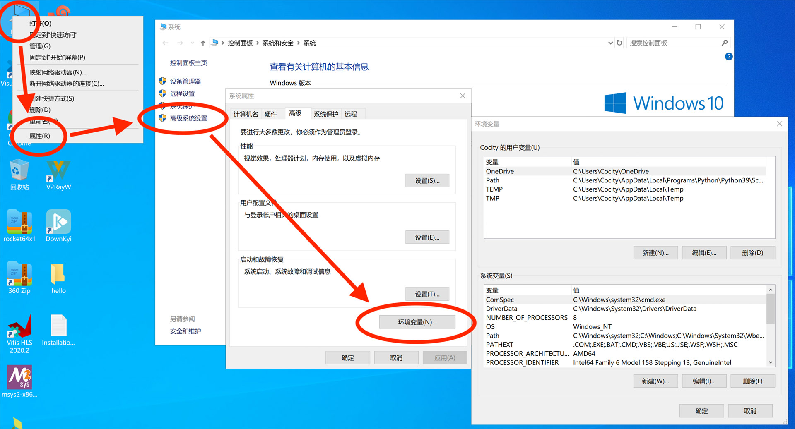

# Windows配置C开发环境

## 安装VSCode编辑器
* VSCode是微软推出的代码编辑器，支持多种代码编辑，并且有丰富的插件选择
* 下载地址：[https://code.visualstudio.com/](https://code.visualstudio.com/)
  * 如果下载速度太慢，也可以从 [[北大网盘]计算概论B](https://disk.pku.edu.cn/link/8B598C5042983A416FDED55ACFFB0A79) 下载：VSCodeUserSetup-x64-1.71.0.exe
* 安装完成后，打开软件界面如下所示

## 安装VSCode C/C++插件
* 该插件可以针对C/C++代码进行高亮显示、语法检查等，可以大大提高写代码的效率，非常建议安装
* 在VSCode界面的左侧点击插件图标，搜索“C/C++”，选择第一个，点击“安装”

## 安装GCC编译器
* GCC是GNU Compiler Collection的简称，用于将文本格式的C代码编译成机器可执行的二进制代码
* 由于GCC本身是针对Linux开发的软件，这里我们用MSYS2的移植版，下载地址：[https://www.msys2.org/](https://www.msys2.org/)
  * 如果下载速度太慢，也可以从 [[北大网盘]计算概论B](https://disk.pku.edu.cn/link/8B598C5042983A416FDED55ACFFB0A79) 下载：msys2-x86_64-20220904.exe
* 安装，一直选“下一步”即可

* 安装到“正在安装组件 MSYS2 base”这一步时似乎会卡住，估计是因为墙的问题，亲测取消再重新运行安装包就好了
  * <b>注意</b>：取消要取消两遍才能退出；重新安装的时候不要清空`C:\msys64`目录，忽略警告
* 安装完成后弹出一个命令行窗口，在窗口中输入如下命令（这玩意居然不能复制粘贴），然后回车

* 中间第一次询问直接敲回车，第二次输入“Y”敲回车，等待安装完成即可，安装完毕如下所示

## 将GCC编译器的安装地址加入PATH
* 为了方便命令行使用，避免每次都使用完整路径调用GCC，我们需要将GCC的目录加入PATH
* 点击此电脑->属性->高级系统设置->环境变量

* 选中“用户变量”中的“Path”，点击“编辑”，在弹出窗口中选择“新建”，输入`C:\msys64\mingw64\bin`，然后点确定返回

* 回到桌面，同时按下Win+R，输入`cmd`，点“确定”，调出命令行窗口
* 在窗口中输入`gcc --version`，回车，若显示如下，说明安装成功

## 打开HelloWorld工程
* VSCode使用工程的方式管理文件，即使你只有一个`.c`文件，也需要建立一个工程来激活运行、检查等功能
* 由于C工程需要配置`launch.json`和`tasks.json`两个文件，比较复杂，所以我已经为大家准备好了一个`hello`工程，从 [[北大网盘]计算概论B](https://disk.pku.edu.cn/link/8B598C5042983A416FDED55ACFFB0A79) 下载：hello.zip，下载完解压得到一个`hello`文件夹
* 新建或打开工程的方法为File->Open Folder，选择刚刚解压出来的那个`hello`文件夹，点击“选择文件夹”

* 打开文件夹后，在左边文件栏即可看到工程名称“HELLO”和工程中的文件，这是打开成功的标志

## 简单命令行编译
* 首先我们用命令行简单编译运行一个`hello.c`程序，命令行速度较快，适合测试简单的程序
* 点击Terminal->New Terminal，可以看到下方弹出了一个命令行窗口
* 输入`gcc hello.c -o hello.exe`进行编译，编译完后，在`hello`文件夹下可以看到一个`hello.exe`文件，这个就是我们的二进制可执行文件
* 在命令行中输入`./hello.exe`来运行，可以看到命令行输出了“Hello, world!”信息

## 断点调试
* 打开`breakpoint.c`文件，按F5（或点击Run->Start Debugging），在下面的命令行（注意是“Terminal”窗口）中输入两个数字，回车，即可看到打印出了两个数字的和

* 如果我们想知道程序运行中某个时刻变量的值，就可以用断点调试，例如下面在第7行设置一个断点
* <b>提示</b>：鼠标移到“7”左边，待出现一个红点时点击，即在这一行设置了一个断点

* 同样，按F5运行，在“Terminal”中输入两个数字，回车，但接下来程序不会立刻输出结果，而是在第7行暂停，如图所示

* 在左边的“Variables”中可以看到，此时`a`为1，`b`为2，由于第7行还没有执行，所以`c`的值还没有算出来，`c`的值是无效值（虽然显示为0，但实际上是无效值）
* 点击上方的“Step Over”按钮，代码往前执行了一行，此时再看右边可以发现`c`的值已经算出来为3了

* 点击上方的“Continue”按钮，代码继续执行直到结束，此时“Terminal”中输出结果“3”，调试结束

